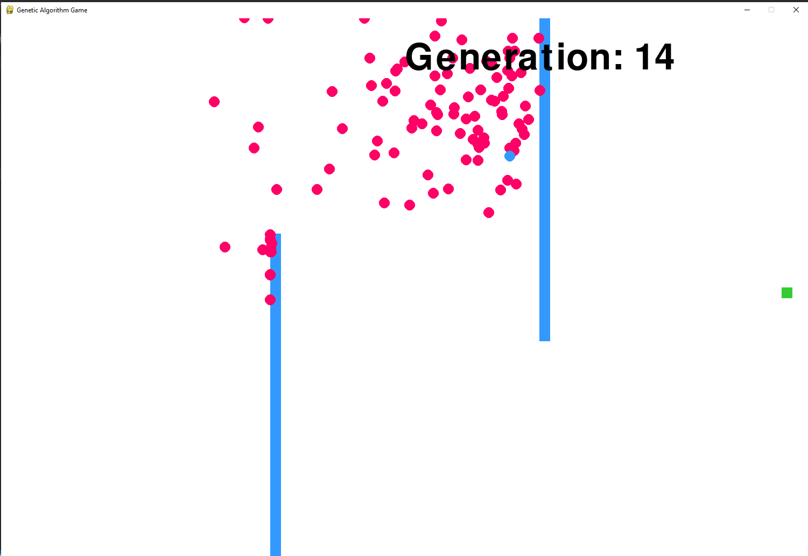
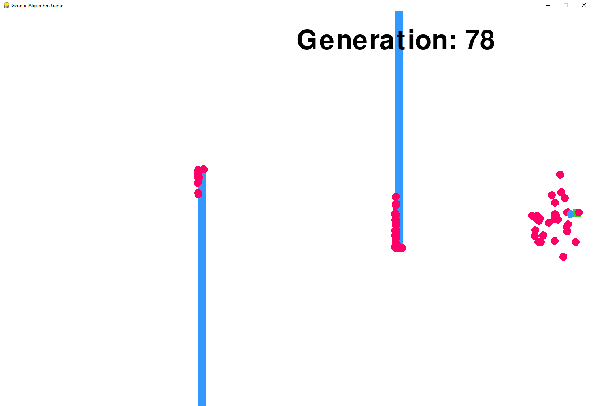

# My First Genetic Algorithm Experience

I recently stumbled upon this concept and got interested. These algorithms solve or optimize solutions to problems by only using algorithms that are very similar to that of evolution's. Using only these relatively simple mechanisms, agents are able to learn fairly quickly on the problem I have implemented here. 

This example and code are heavily inspired by the Blogpost I have regarding this topic by [Luke Garrigan](https://dev.to/lukegarrigan/genetic-algorithms-in-javascript-mc3) and the YouTube channel [Code Bullet](https://www.youtube.com/watch?v=BOZfhUcNiqk).

* Genetic Algorithm's consist of 5 main steps to implement
	1. Creation of a new generation
	2. Evaluating the fitnesses of each individual
	3. Selecting the successful ones
	4. Reproduction
	5. Mutation

In my case, the ones with higher fitness values are most likely (but not certainly) to be selected. Following this, their offspring are given a 2% chance of mutation.

In about 50 generations, they were able to overcome the obstacles I have put in their way.

